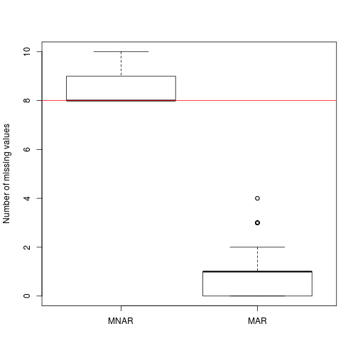

# Proteomics data: caveats


**Mapping** of *peptides along protein sequences (although not
  explicitly considered a mapping exercise)* and *short reads along
  genome coordinates*.

But...

## Protein inference

<!--  -->


From [Qeli and Ahrens (2010)](http://www.ncbi.nlm.nih.gov/pubmed/20622826).
See also [Nesvizhskii and Aebersold (2005)](http://www.ncbi.nlm.nih.gov/pubmed/16009968).

Often, in proteomics experiments, the features represent single
proteins and **groups** of indistinguishable or non-differentiable
proteins identified by shared (non-unique) peptides.

**Caveat**: Mapping between protein groups and unique transcripts?

## Mapping protein and gene identifers

The protein database and the genome are _independent_, i.e. the
proteins do not make explicitly reference to the genome they originate
from.


If we want to map UniProt accession to genomic identifiers (Ensembl
transcipt identifiers):


- The UniProt human proteome (release 2015_02) has 89796 entries.

- If we query the Ensembl Biomart server for their transcript
  identifiers, we obtain results for 19015.


| FALSE|  TRUE|
|-----:|-----:|
| 70781| 19015|

- Among these, most map to mulitple transcript identifiers.


```r
## How many transcripts per accession do we find?
tab <- rbind(table(table(upbm$uniprot_swissprot_accession)))
kable(tab)
```


|    1|    2|    3|    4|   5|   6|   7|   8|  9| 10| 11| 12| 13| 14| 15| 16| 17| 18| 19| 20| 21| 22| 23| 24| 27| 29| 30| 31| 32| 33| 35| 42| 44| 50| 59| 90|
|----:|----:|----:|----:|---:|---:|---:|---:|--:|--:|--:|--:|--:|--:|--:|--:|--:|--:|--:|--:|--:|--:|--:|--:|--:|--:|--:|--:|--:|--:|--:|--:|--:|--:|--:|--:|
| 8237| 5056| 2602| 1404| 713| 383| 219| 112| 78| 56| 35| 17| 16| 15| 12|  8|  7|  4|  6|  5|  5|  2|  2|  3|  1|  1|  1|  2|  3|  1|  3|  2|  1|  1|  1|  1|
**Caveat**: Mapping between single protein and unique transcripts?

## Coverage

- Proteomics in `%`
- RNA-Seq in fold `X`


```r
cvg <- data.table::fread("./data/Ensembl_76.csv", skip = 17,
                         stringsAsFactors = FALSE)
summary(cvg$coverage)
```

```
##    Min. 1st Qu.  Median    Mean 3rd Qu.    Max. 
##   0.000   6.813  38.890  39.870  67.620 100.000
```

This has an impact on **protein inference** (see above) and **missing
values** for quantitation.

## Missing values

 There are two types of mechanisms resulting in missing values in
 LC/MSMS experiments.

- Missing values resulting from absence of detection of a feature,
  despite ions being present at detectable concentrations.  For
  example in the case of ion suppression or as a result from the
  stochastic, data-dependent nature of the MS acquisition
  method. These missing value are expected to be randomly distributed
  in the data and are defined as **missing at random** (MAR) or
  **missing completely at random** (MCAR).

- Biologically relevant missing values, resulting from the absence of
  the low abundance of ions (below the limit of detection of the
  instrument). These missing values are not expected to be randomly
  distributed in the data and are defined as **missing not at random**
  (MNAR).

MNAR features should ideally be imputed with a **left-censor**
(minimum value, ~zero~, ...)  method. Conversely, it is recommended to
use **hot deck** methods (nearest neighbour, maximum likelihood, ...)
when data are missing at random.


```r
library("MSnbase")
data(naset)

table(is.na(naset))
```

```
## 
## FALSE  TRUE 
## 10254   770
```

```r
table(fData(naset)$nNA)
```

```
## 
##   0   1   2   3   4   8   9  10 
## 301 247  91  13   2  23  10   2
```

```r
fData(naset)$rwmn <- rowMeans(exprs(naset), na.rm = TRUE)

boxplot(fData(naset)$nNA ~ fData(naset)$randna,
        names = c("MNAR", "MAR"),
        ylab = "Number of missing values")
abline(h = 8, col = "red")
```

 

```r
x <- impute(naset, method = "mixed",
            randna = fData(naset)$randna,
            mar = "knn", mnar = "min")
## xv <- MSnbase:::imageNA2(naset, factor(rep(1:2, each = 8)))
## plot(fData(naset)$randna[xv],
##      ylab = "MNAR - MAR")
```


