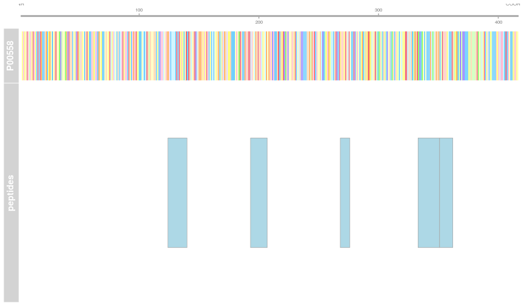
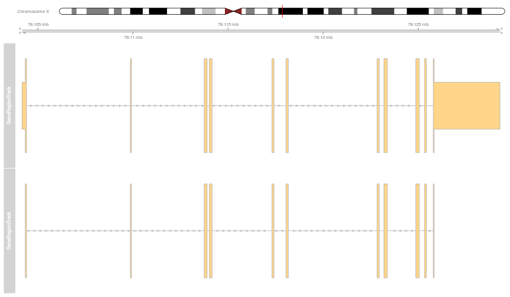

# Mapping peptides to genomic coordinates

Illustration with [`Pbase`](http://bioconductor.org/packages/devel/bioc/html/Pbase.html).


We have an example data composed of 9 proteins, with
UniProt accession numbers and Ensembl transcipt identifers and each
protein has a set experimentally observed peptides:


|Acc      |ENST            |npep |
|:--------|:---------------|:----|
|A4UGR9   |ENST00000409195 |36   |
|A6H8Y1   |ENST00000358731 |23   |
|O43707   |ENST00000252699 |6    |
|O75369   |ENST00000295956 |13   |
|P00558   |ENST00000373316 |5    |
|P02545   |ENST00000368300 |12   |
|P04075   |ENST00000338110 |21   |
|P04075-2 |ENST00000395248 |20   |
|P60709   |ENST00000331789 |1    |

For example, P00558:

 

## Genomic coordinates of the transcripts/exons


```r
grl <- etrid2grl(acols(p)$ENST)
pcgrl <- proteinCoding(grl)
```

 
