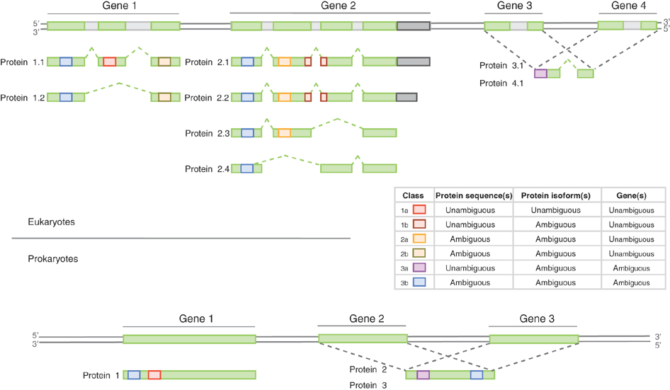

# Proteomics data: caveats


**Mapping** of *peptides along protein sequences (although not
  explicitly considered a mapping exercise)* and *short reads along
  genome coordinates*.

But...

## Coverage

- Coverage in proteomics in `%`
- [Coverage](http://www.ncbi.nlm.nih.gov/pubmed/24434847) in RNA-Seq in fold `X`

The following values are higher bounds, *without* peptide filtering for
about 80000 *gene groups* 

 

## Protein inference

<!--  -->




From [Qeli and Ahrens (2010)](http://www.ncbi.nlm.nih.gov/pubmed/20622826).
See also [Nesvizhskii and Aebersold (2005)](http://www.ncbi.nlm.nih.gov/pubmed/16009968).

Often, in proteomics experiments, the features represent single
proteins and **groups** of indistinguishable or non-differentiable
proteins identified by shared (non-unique) peptides.

**Caveat**: Mapping between protein groups and unique transcripts?

## Mapping protein and gene identifers

The protein database and the genome are _independent_, i.e. the
proteins do not make explicitly reference to the genome they originate
from.


If we want to map UniProt accession to genomic identifiers (Ensembl
transcipt identifiers):


- The UniProt human proteome (release 2015_02) has 89796 entries.

- If we query the Ensembl Biomart server for their transcript
  identifiers, we obtain results for 19015.


| FALSE|  TRUE|
|-----:|-----:|
| 70781| 19015|

- Among these, about half map to mulitple transcript identifiers.

 

**Caveat**: Mapping between single protein and unique transcripts?

## Missing values

An example data:


```r
library("MSnbase")
data(naset)
naset
```

```
## MSnSet (storageMode: lockedEnvironment)
## assayData: 689 features, 16 samples 
##   element names: exprs 
## protocolData: none
## phenoData
##   sampleNames: M1F1A M1F4A ... M2F11B (16 total)
##   varLabels: nNA
##   varMetadata: labelDescription
## featureData
##   featureNames: AT1G09210 AT1G21750 ... AT4G39080 (689 total)
##   fvarLabels: nNA randna
##   fvarMetadata: labelDescription
## experimentData: use 'experimentData(object)'
## Annotation:  
## - - - Processing information - - -
##  MSnbase version: 1.15.6
```

```r
table(is.na(naset))
```

```
## 
## FALSE  TRUE 
## 10254   770
```

```r
table(fData(naset)$nNA)
```

```
## 
##   0   1   2   3   4   8   9  10 
## 301 247  91  13   2  23  10   2
```

Options are:

### Filtering

Remove missing values, or at least features or samples with excessive number of missing values:


```r
flt <- filterNA(naset)
processingData(flt)
```

```
## - - - Processing information - - -
## Subset [689,16][301,16] Wed Mar  4 15:36:39 2015 
## Removed features with more than 0 NAs: Wed Mar  4 15:36:39 2015 
## Dropped featureData's levels Wed Mar  4 15:36:39 2015 
##  MSnbase version: 1.15.6
```

```r
any(is.na(filterNA(naset)))
```

```
## [1] FALSE
```

### Data imputation

There are two types of mechanisms resulting in missing values in
LC/MSMS experiments.

- Missing values resulting from absence of detection of a feature,
  despite ions being present at detectable concentrations.  For
  example in the case of ion suppression or as a result from the
  stochastic, data-dependent nature of the MS acquisition
  method. These missing value are expected to be randomly distributed
  in the data and are defined as **missing at random** (MAR) or
  **missing completely at random** (MCAR).

- Biologically relevant missing values, resulting from the *absence*
  of the low abundance of ions (below the limit of detection of the
  instrument). These missing values are not expected to be randomly
  distributed in the data and are defined as **missing not at random**
  (MNAR).


(`KNN` and `MinDet` - with Cosmin Lazar and Thomas Burger)

MNAR features should ideally be imputed with a **left-censor**
(minimum value, ~zero~, ...)  method. Conversely, it is recommended to
use **hot deck** methods (nearest neighbour, maximum likelihood, ...)
when data are missing at random.

 


```r
x <- impute(naset, method = "mixed",
            randna = fData(naset)$randna,
            mar = "knn", mnar = "min")
x
```

```
## MSnSet (storageMode: lockedEnvironment)
## assayData: 689 features, 16 samples 
##   element names: exprs 
## protocolData: none
## phenoData
##   sampleNames: M1F1A M1F4A ... M2F11B (16 total)
##   varLabels: nNA
##   varMetadata: labelDescription
## featureData
##   featureNames: AT1G09210 AT1G21750 ... AT4G39080 (689 total)
##   fvarLabels: nNA randna
##   fvarMetadata: labelDescription
## experimentData: use 'experimentData(object)'
## Annotation:  
## - - - Processing information - - -
## Data imputation using mixed Wed Mar  4 15:36:40 2015 
##   Using default parameters 
##  MSnbase version: 1.15.6
```

## Session information


```r
sessionInfo()
```

```
## R Under development (unstable) (2015-01-22 r67580)
## Platform: x86_64-unknown-linux-gnu (64-bit)
## Running under: Ubuntu 14.04.1 LTS
## 
## locale:
##  [1] LC_CTYPE=en_GB.UTF-8       LC_NUMERIC=C              
##  [3] LC_TIME=en_GB.UTF-8        LC_COLLATE=en_GB.UTF-8    
##  [5] LC_MONETARY=en_GB.UTF-8    LC_MESSAGES=en_GB.UTF-8   
##  [7] LC_PAPER=en_GB.UTF-8       LC_NAME=C                 
##  [9] LC_ADDRESS=C               LC_TELEPHONE=C            
## [11] LC_MEASUREMENT=en_GB.UTF-8 LC_IDENTIFICATION=C       
## 
## attached base packages:
##  [1] grid      stats4    parallel  methods   stats     graphics  grDevices
##  [8] utils     datasets  base     
## 
## other attached packages:
##  [1] gplots_2.16.0         knitr_1.9             MSnbase_1.15.6       
##  [4] BiocParallel_1.1.13   mzR_2.1.12            Biobase_2.27.2       
##  [7] Pbase_0.6.11          Gviz_1.11.12          GenomicRanges_1.19.42
## [10] GenomeInfoDb_1.3.13   IRanges_2.1.41        S4Vectors_0.5.21     
## [13] Rcpp_0.11.4.7         BiocGenerics_0.13.6  
## 
## loaded via a namespace (and not attached):
##  [1] acepack_1.3-3.3           affy_1.45.2              
##  [3] affyio_1.35.0             AnnotationDbi_1.29.17    
##  [5] base64enc_0.1-2           BatchJobs_1.5            
##  [7] BBmisc_1.9                BiocInstaller_1.17.5     
##  [9] biomaRt_2.23.5            Biostrings_2.35.11       
## [11] biovizBase_1.15.2         bitops_1.0-6             
## [13] brew_1.0-6                BSgenome_1.35.17         
## [15] caTools_1.17.1            checkmate_1.5.1          
## [17] chron_2.3-45              cleaver_1.5.3            
## [19] cluster_2.0.1             codetools_0.2-10         
## [21] colorspace_1.2-4          data.table_1.9.4         
## [23] DBI_0.3.1                 dichromat_2.0-0          
## [25] digest_0.6.8              doParallel_1.0.8         
## [27] evaluate_0.5.5            fail_1.2                 
## [29] foreach_1.4.2             foreign_0.8-63           
## [31] formatR_1.0               Formula_1.2-0            
## [33] gdata_2.13.3              GenomicAlignments_1.3.29 
## [35] GenomicFeatures_1.19.20   ggplot2_1.0.0            
## [37] gtable_0.1.2              gtools_3.4.1             
## [39] Hmisc_3.15-0              impute_1.41.0            
## [41] iterators_1.0.7           KernSmooth_2.23-14       
## [43] lattice_0.20-30           latticeExtra_0.6-26      
## [45] limma_3.23.10             MALDIquant_1.11          
## [47] MASS_7.3-39               matrixStats_0.14.0       
## [49] munsell_0.4.2             mzID_1.5.2               
## [51] nnet_7.3-9                pcaMethods_1.57.2        
## [53] plyr_1.8.1                preprocessCore_1.29.0    
## [55] ProtGenerics_0.99.1       proto_0.3-10             
## [57] Pviz_1.1.1                RColorBrewer_1.1-2       
## [59] RCurl_1.95-4.5            reshape2_1.4.1           
## [61] rpart_4.1-9               Rsamtools_1.19.38        
## [63] RSQLite_1.0.0             rtracklayer_1.27.8       
## [65] scales_0.2.4              sendmailR_1.2-1          
## [67] splines_3.2.0             stringr_0.6.2            
## [69] survival_2.38-1           tools_3.2.0              
## [71] VariantAnnotation_1.13.38 vsn_3.35.0               
## [73] XML_3.98-1.1              XVector_0.7.4            
## [75] zlibbioc_1.13.1
```

| [Home](./README.md) | [Caveats](./caveats.md) | [Mapping](./mapping.md) | [Transfer learning](./transfer-learning.md) |

