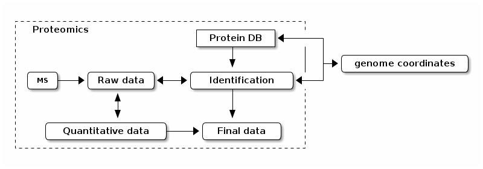
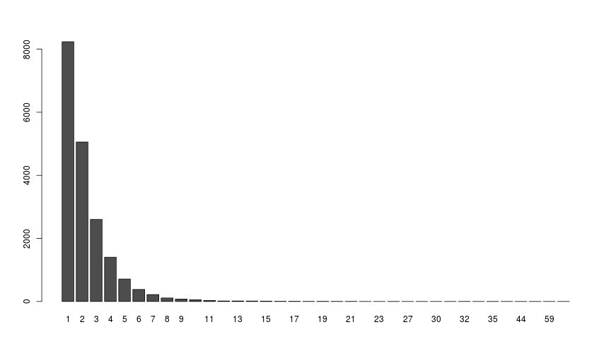

# Proteomics data: caveats


**Mapping** of *peptides along protein sequences (although not
  explicitly considered a mapping exercise)* and *short reads along
  genome coordinates*.

But...

## Coverage

- Proteomics in `%`
- RNA-Seq in fold `X`

The following values are higher bounds, without peptide filtering for
gene groups.

 

| Min.| 1st Qu.| Median|  Mean| 3rd Qu.| Max.|
|----:|-------:|------:|-----:|-------:|----:|
|    0|   10.61|  42.41| 42.13|   69.51|  100|

## Protein inference

<!--  -->


From [Qeli and Ahrens (2010)](http://www.ncbi.nlm.nih.gov/pubmed/20622826).
See also [Nesvizhskii and Aebersold (2005)](http://www.ncbi.nlm.nih.gov/pubmed/16009968).

Often, in proteomics experiments, the features represent single
proteins and **groups** of indistinguishable or non-differentiable
proteins identified by shared (non-unique) peptides.

**Caveat**: Mapping between protein groups and unique transcripts?

## Mapping protein and gene identifers

The protein database and the genome are _independent_, i.e. the
proteins do not make explicitly reference to the genome they originate
from.




If we want to map UniProt accession to genomic identifiers (Ensembl
transcipt identifiers):


- The UniProt human proteome (release 2015_02) has 89796 entries.

- If we query the Ensembl Biomart server for their transcript
  identifiers, we obtain results for 19015.


| FALSE|  TRUE|
|-----:|-----:|
| 70781| 19015|

- Among these, about half map to mulitple transcript identifiers.

 

**Caveat**: Mapping between single protein and unique transcripts?

## Missing values

An example data:


```r
library("MSnbase")
data(naset)
naset
```

```
## MSnSet (storageMode: lockedEnvironment)
## assayData: 689 features, 16 samples 
##   element names: exprs 
## protocolData: none
## phenoData
##   sampleNames: M1F1A M1F4A ... M2F11B (16 total)
##   varLabels: nNA
##   varMetadata: labelDescription
## featureData
##   featureNames: AT1G09210 AT1G21750 ... AT4G39080 (689 total)
##   fvarLabels: nNA randna
##   fvarMetadata: labelDescription
## experimentData: use 'experimentData(object)'
## Annotation:  
## - - - Processing information - - -
##  MSnbase version: 1.15.6
```

```r
table(is.na(naset))
```

```
## 
## FALSE  TRUE 
## 10254   770
```

```r
table(fData(naset)$nNA)
```

```
## 
##   0   1   2   3   4   8   9  10 
## 301 247  91  13   2  23  10   2
```

There are two types of mechanisms resulting in missing values in
LC/MSMS experiments.

Options are:

### Filtering

Remove missing values, or at least features or samples with excessive number of missing values:


```r
flt <- filterNA(naset)
processingData(flt)
```

```
## - - - Processing information - - -
## Subset [689,16][301,16] Thu Feb 26 11:52:33 2015 
## Removed features with more than 0 NAs: Thu Feb 26 11:52:33 2015 
## Dropped featureData's levels Thu Feb 26 11:52:33 2015 
##  MSnbase version: 1.15.6
```

```r
any(is.na(filterNA(naset)))
```

```
## [1] FALSE
```

### Data imputation

- Missing values resulting from absence of detection of a feature,
  despite ions being present at detectable concentrations.  For
  example in the case of ion suppression or as a result from the
  stochastic, data-dependent nature of the MS acquisition
  method. These missing value are expected to be randomly distributed
  in the data and are defined as **missing at random** (MAR) or
  **missing completely at random** (MCAR).

- Biologically relevant missing values, resulting from the *absence*
  of the low abundance of ions (below the limit of detection of the
  instrument). These missing values are not expected to be randomly
  distributed in the data and are defined as **missing not at random**
  (MNAR).

MNAR features should ideally be imputed with a **left-censor**
(minimum value, ~zero~, ...)  method. Conversely, it is recommended to
use **hot deck** methods (nearest neighbour, maximum likelihood, ...)
when data are missing at random.


```
## 
## Attaching package: 'gplots'
## 
## The following object is masked from 'package:IRanges':
## 
##     space
## 
## The following object is masked from 'package:stats':
## 
##     lowess
```

```
## Error in plot.new(): figure margins too large
```

 


```r
x <- impute(naset, method = "mixed",
            randna = fData(naset)$randna,
            mar = "knn", mnar = "min")
x
```

```
## MSnSet (storageMode: lockedEnvironment)
## assayData: 689 features, 16 samples 
##   element names: exprs 
## protocolData: none
## phenoData
##   sampleNames: M1F1A M1F4A ... M2F11B (16 total)
##   varLabels: nNA
##   varMetadata: labelDescription
## featureData
##   featureNames: AT1G09210 AT1G21750 ... AT4G39080 (689 total)
##   fvarLabels: nNA randna
##   fvarMetadata: labelDescription
## experimentData: use 'experimentData(object)'
## Annotation:  
## - - - Processing information - - -
## Data imputation using mixed Thu Feb 26 11:52:34 2015 
##   Using default parameters 
##  MSnbase version: 1.15.6
```

