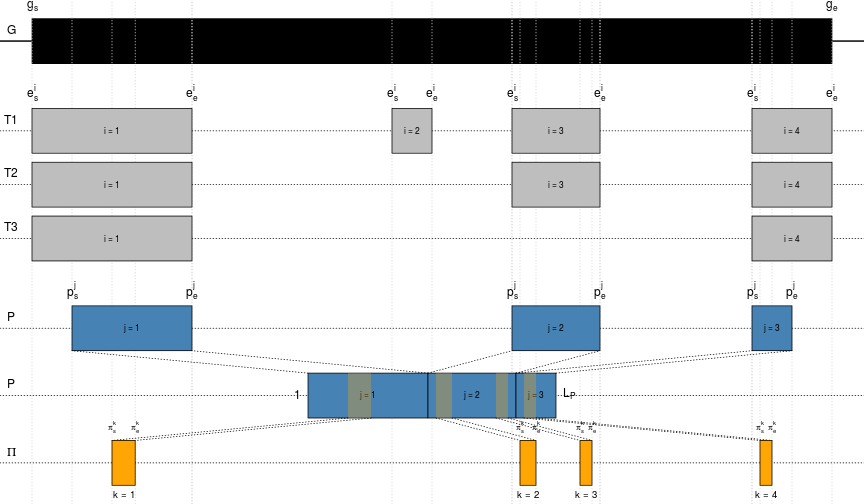
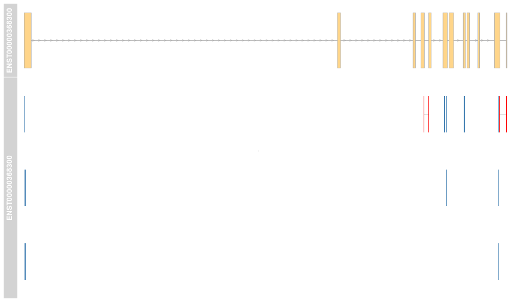

# Integrating transcriptomics and proteomics data

Different approaches to data integration exist: (i) model- or
network-based approaches that identify common patterns in different
data sources as well as (ii) reference-based approaches, that map
different sources of data against a common reference.


The former are very versatile and rely on experiment-wide
clustering/modelling and crucially depend on reliably linking features
(explicitly via common identifiers or through functional
contextualisation). Transcript and protein measurement have previously
been combined and compared by linking the respective features by a
**common (gene) identifier** 
([1](http://www.ncbi.nlm.nih.gov/pubmed/21179022),
[2](http://www.ncbi.nlm.nih.gov/pubmed/22068331)). Such approaches are
often difficult to track and are susceptible to inconsistencies in the
relation between different data sources when, for example, multiple
transcripts are compared to ambiguous protein groups. The latter
approaches are a natural choice for data stemming from genomics,
transcriptomics, epigenomics, etc that directly rely on **mapping** their
data features along a **genome reference**.

# Mapping peptides to genomic coordinates


```
## Warning: multiple methods tables found for 'score'
```

```
## Warning: multiple methods tables found for 'score'
```

```
## Warning: multiple methods tables found for 'score'
```

```
## Warning: multiple methods tables found for 'fileName'
```

The **goal** is to map peptides from protein coordinates (1 to *L_p*)
to genomic coordinates.

 

Illustration with the
[`Pbase`](http://bioconductor.org/packages/devel/bioc/html/Pbase.html)
Bioconductor package (devel version).

## Data

We have an example data, named `p`, composed of 9
proteins, with UniProt accession numbers and Ensembl transcipt
identifers and each protein has a set experimentally observed
peptides:


|Acc      |ENST            |npep |
|:--------|:---------------|:----|
|A4UGR9   |ENST00000409195 |36   |
|A6H8Y1   |ENST00000358731 |23   |
|O43707   |ENST00000252699 |6    |
|O75369   |ENST00000295956 |13   |
|P00558   |ENST00000373316 |5    |
|P02545   |ENST00000368300 |12   |
|P04075   |ENST00000338110 |21   |
|P04075-2 |ENST00000395248 |20   |
|P60709   |ENST00000331789 |1    |

For example, P00558:

 

## Genomic coordinates of the transcripts/exons


```r
grl <- etrid2grl(acols(p)$ENST)
pcgrl <- proteinCoding(grl)
```

 

## Mapping peptides to the genome


```r
res <- pmapToGenome(p, pcgrl)
```

 

## Detailed annotation tracks

Maintaining access to the raw MS data

 


# Multiple transcipts per protein

## Data

We use our example data, named `p`, composed of 9
proteins, with UniProt accession numbers and Ensembl transcipt
identifers and each protein has a set experimentally observed
peptides:


|Acc      |ENST            |npep |
|:--------|:---------------|:----|
|A4UGR9   |ENST00000409195 |36   |
|A6H8Y1   |ENST00000358731 |23   |
|O43707   |ENST00000252699 |6    |
|O75369   |ENST00000295956 |13   |
|P00558   |ENST00000373316 |5    |
|P02545   |ENST00000368300 |12   |
|P04075   |ENST00000338110 |21   |
|P04075-2 |ENST00000395248 |20   |
|P60709   |ENST00000331789 |1    |

If we hadn't the curated UniProt accession/Ensembl transcript
identifer maps, we would, for example, query an online repositary such
as the Ensembl Biomart instance.


```r
library("biomaRt")
ens <- useMart("ensembl", "hsapiens_gene_ensembl")
ens
```

```
## Object of class 'Mart':
##  Using the ensembl BioMart database
##  Using the hsapiens_gene_ensembl dataset
```


```r
bm <- select(ens, keys = seqnames(p),
             keytype = "uniprot_swissprot_accession",
             columns = c(
                 "uniprot_swissprot_accession",
                 "ensembl_transcript_id"))

bm
```

```
##    uniprot_swissprot_accession ensembl_transcript_id
## 1                       A4UGR9       ENST00000409043
## 2                       A4UGR9       ENST00000409728
## 3                       A4UGR9       ENST00000409195
## 4                       A4UGR9       ENST00000409273
## 5                       A4UGR9       ENST00000409605
## 6                       A6H8Y1       ENST00000617085
## 7                       A6H8Y1       ENST00000358731
## 8                       O43707       ENST00000252699
## 9                       O43707       ENST00000390009
## 10                      O75369       ENST00000490882
## 11                      O75369       ENST00000295956
## 12                      O75369       ENST00000358537
## 13                      O75369       ENST00000429972
## 14                      P00558       ENST00000373316
## 15                      P02545       ENST00000368301
## 16                      P02545       ENST00000368300
## 17                      P02545       ENST00000368299
## 18                      P02545       ENST00000448611
## 19                      P02545       ENST00000473598
## 20                      P02545       ENST00000508500
## 21                      P02545       ENST00000347559
## 22                      P04075       ENST00000338110
## 23                      P04075       ENST00000395248
## 24                      P04075       ENST00000566897
## 25                      P04075       ENST00000569545
## 26                      P04075       ENST00000563060
## 27                      P04075       ENST00000412304
## 28                      P04075       ENST00000564546
## 29                      P04075       ENST00000564595
## 30                      P60709       ENST00000331789
```


If we focus on P02545 for example, we see that we
retrieve 7 possible transcript identifers, including our
annotated ENST00000368300.


|uniprot_swissprot_accession |ensembl_transcript_id |
|:---------------------------|:---------------------|
|P02545                      |ENST00000368301       |
|P02545                      |ENST00000368300       |
|P02545                      |ENST00000368299       |
|P02545                      |ENST00000448611       |
|P02545                      |ENST00000473598       |
|P02545                      |ENST00000508500       |
|P02545                      |ENST00000347559       |

## Genomic coordinates

Let's fetch the coordinates of all possible transcipts, making sure
that the names of the Ensembl identifiers are used to name the grl
ranges (using `use.names = TRUE`). We obtain 30 sets of ranges for 9
proteins.


```r
eid
```

```
##            P02545            P02545            P02545            P02545 
## "ENST00000368301" "ENST00000368300" "ENST00000368299" "ENST00000448611" 
##            P02545            P02545            P02545 
## "ENST00000473598" "ENST00000508500" "ENST00000347559"
```

```r
grl <- etrid2grl(eid, ens, use.names = TRUE)
pcgrl <- proteinCoding(grl)
```


```r
grTr <- lapply(pcgrl, function(i)
    GeneRegionTrack(i, name = mcols(i)$transcript[1]))

plotTracks(grTr)
```

 

## Discriminating transcripts


We extract the transcript sequences, translate them into protein
sequences and align each to our original protein sequence.


```r
library("BSgenome.Hsapiens.NCBI.GRCh38")
lseq <- lapply(getSeq(BSgenome.Hsapiens.NCBI.GRCh38, pcgrl),
               function(s) translate(unlist(s)))

laln <- sapply(lseq, pairwiseAlignment, aa(p[k]))
sapply(laln, nmatch)/width(aa(p[k]))
```

```
##    P02545    P02545    P02545    P02545    P02545    P02545    P02545 
## 0.8614458 1.0000000 0.9246988 0.8298193 0.8358434 0.3915663 0.9548193
```


```
## ########################################
## # Program: Biostrings (version 2.35.11), a Bioconductor package
## # Rundate: Tue Mar  3 10:36:41 2015
## ########################################
```

```
## Warning in writePairwiseAlignments(laln[[ki]]): 'x' is an empty
## PairwiseAlignments object -> nothing to write
```

```
## #---------------------------------------
## #---------------------------------------
```

We see that transcript number 2, ENST00000368300, perfectly aligns
with our protein sequence. This is also the transcipt that corresponds
to the curated Ensembl transcript in `acols(p)$ENST`.


```r
res <- pmapToGenome(p[k], pcgrl[ki])
```


 

# Mapping MS peptides and RNA-Seq short reads

The last step of the mapping process is the combine the newly mapped
peptides and reads from RNA-Seq experiments. The figures below
illustrate this with data from Sheynkman et
al. ([2013](http://www.ncbi.nlm.nih.gov/pubmed/23629695),
[2014](http://www.ncbi.nlm.nih.gov/pubmed/25149441)) from the Jurkat
cell line (TIB-152). The
[mass spectrometry](https://db.systemsbiology.net/sbeams/cgi/PeptideAtlas/PASS_View?identifier=PASS00215)
and
[RNA-Seq](http://www.ncbi.nlm.nih.gov/geo/query/acc.cgi?acc=GSE45428)
(SRR791580) where processed with standard pipelines. 


  

 

### References

Laurent Gatto and Sebastian Gibb
(2014). [`Pbase`](http://bioconductor.org/packages/devel/bioc/html/Pbase.html):
Manipulating and exploring protein and proteomics data. R package
version 0.6.9. https://github.com/ComputationalProteomicsUnit/Pbase

Pang et al. Tools to covisualize and coanalyze proteomic data with
genomes and transcriptomes: validation of genes and alternative mRNA
splicing. J Proteome Res. 2014 Jan 3;13(1):84-98. doi:
10.1021/pr400820p. Epub 2013 Nov 12. PubMed
[PMID: 24152167](http://www.ncbi.nlm.nih.gov/pubmed/24152167).

| [Home](./README.md) | [Caveats](./Caveats.md) | [Mapping](./mapping.md) | [Transfer learning](./transfer-learning.md) |
